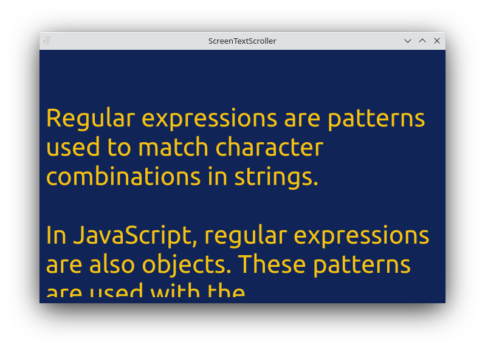
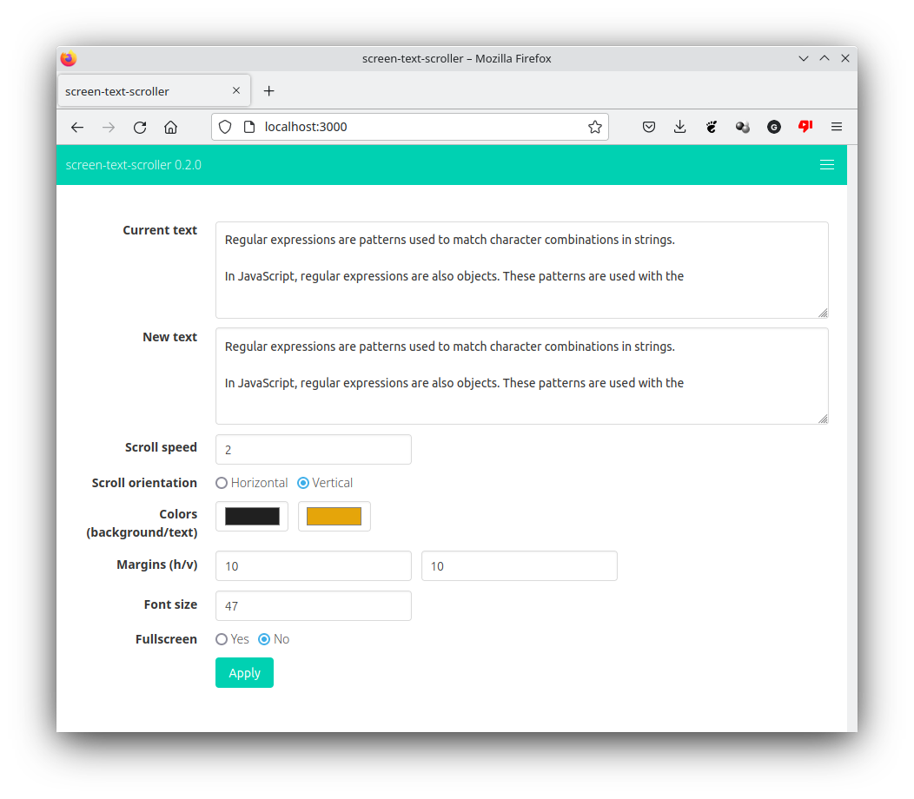

ScreenTextScroller
=======

**ScreenTextScroller** is a desktop application showing a fullscreen scrolling text. You will remotely control it with a browser: you can change the text, color, scrolling speed and direction.

It should be able to run without problems on Linux (Xorg or Wayland), macOS, Windows. Not all video cards are supported.

Currently, only a installable package for debian/ubuntu is available [here](https://github.com/giox069/ScreenTextScroller/releases/latest) for download.

If you want to run this application under windows or macOS, you must compile it with the rust compiler: install rust, clone this git repository, and then compile and run the application with `cargo run --release` command.

Contributors are welcome: for example a windows installer will be very useful (cargo wix is an interesting tool to create a windows installer).

